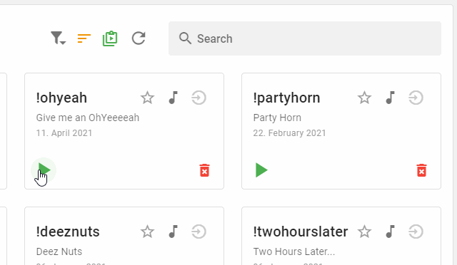

# Discord Sound Bot Website and Electron Desktop App

This is the website for the [discord sound bot](https://github.com/p0thi/discord-sound-bot). It offers the ability to controll every setting and perform every action of the bot.\
It is an alternative to the discord slash command interface.


## Features

- Login with discord
- Edit Guild settings
- Upload new sounds
- Play sounds
- Add sounds and guilds to favourites
- Set join sound for Guilds

### Example Sound Interaction




## Deployment


The easiest way to deploy the bot and the website is with [docker compose](https://docs.docker.com/compose/). An example `docker-compose.yml` file can be found [here](docker-compose.yml).
Note: Other than this webiste, the bot itself needs an `.env` file to be setup. Please reference the [bot repo](https://github.com/p0thi/discord-sound-bot) for an example.

It is recomendet to use yarn as a packet manager. Node 16 is required to run this code.\
The following steps show how to run the code locally:

Install the dependencies:
```bash
  yarn install
```

Run the website locally:
```bash
  yarn serve
```

Build the static web files:
```bash
  yarn build
```

Build the electron installers:
```bash
  yarn electron:build
```


Release the electron installers:
```bash
  yarn electron:release
```